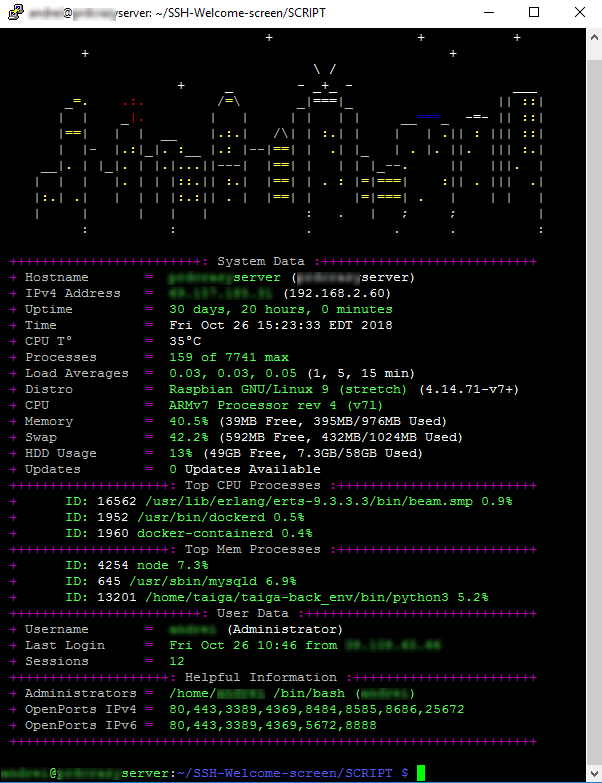

# SSH-Welcome-screen

This screen is what the server administrator ever needs. CPU temperature, Load Average, Memory and Disk usage, Available system updates, etc.

The script is **SCRIPT/MOTD.sh**

The installation process is documented at [my blog](https://habilisbest.com/ssh-welcome-screen).

_Note : This was developed for a Raspberry Pi, should work just fine on other debian-based system using bash shell with minor adjustments._

## Tested on
* Raspberry Pi 3 B
* Raspberry Pi 1 B

## Contributors

Hail to all elegant people contributing to the project!

|   |   |   |   |   |   |   |
|:---:|:---:|:---:|:---:|:---:|:---:|:---:|
|<a href="https://github.com/Habilya"> <b>Habilya</b></a>|<a href="https://github.com/k4ch0"> <b>k4ch0</b></a>|<a href="https://github.com/ccsplit"> <b>ccsplit</b></a>|<a href="https://github.com/watermelon1995"> <b>watermelon1995</b></a>|<a href="https://github.com/tvollscw"> <b>tvollscw</b></a>|<a href="https://github.com/tehtbl"> <b>tehtbl</b></a>|<a href="https://github.com/javier-lopez"> <b>javier-lopez</b></a>|
|<a href="https://github.com/estevao90"> <b>estevao90</b></a>|<a href="https://github.com/a7r3"> <b>a7r3</b></a>|<a href="https://github.com/RytoEX"> <b>RytoEX</b></a>|

Cheers!
